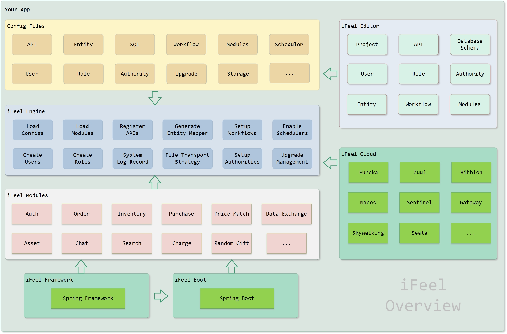

#  iFeel Editor

iFeel Editor provide a graphical interface for the developers, product mangers, business designers, that they could make business application in a easier way. 

Type your project informations, design the apis, database schemas, workflows in the flexible graphical iFeel Editor. Export the project's config files to the powerful  iFeel Engine, you can driver your business right now!

Less code more features!  Make business system like Lego!

Enjoy it now! ;-D

------

## iFeel Overview

